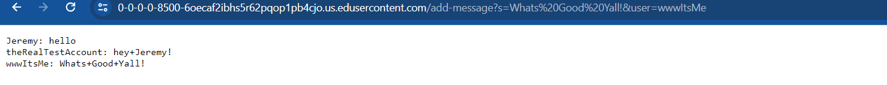
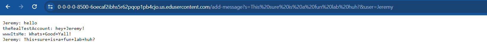
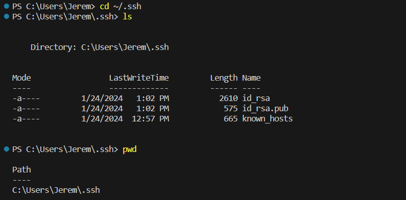
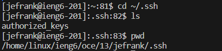
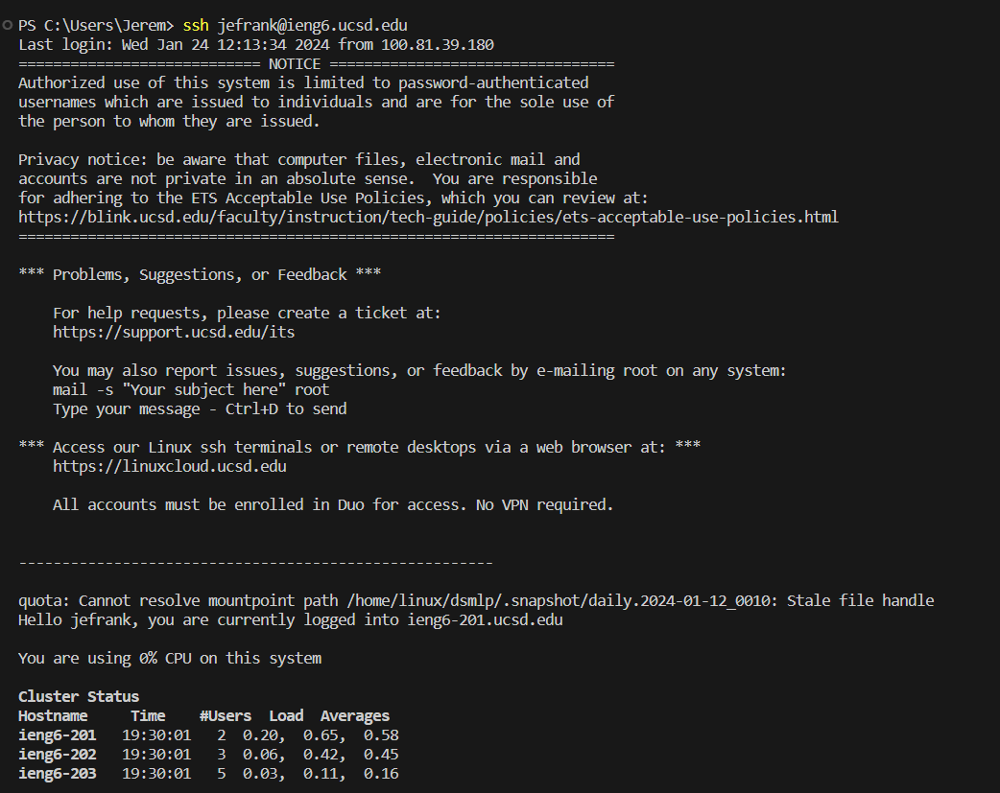

Today's post will be covering servers and `ssh` keys. Lets start by looking at an interesting server I coded.
```
import java.io.IOException;
import java.net.URI;
import java.util.ArrayList;

class Handler implements URLHandler {
    ArrayList<String> database = new ArrayList<>();
    
    public String handleRequest(URI url){
        if (url.getPath().equals("/")){
            return "Please Alter the Path to Start a Conversation";
        }
        else if (url.getPath().equals("/add-message")){
            String[] params = url.getQuery().split("&");
            String message = (params[0].split("="))[1];
            String name = (params[1].split("="))[1];
            database.add(name + ": " + message);
        }
        String result = "";
        for (int i = 0; i<database.size();i++){
            result+=database.get(i) + "\n";
        }
        return result;
    }
}

class ChatServer {
    public static void main(String[] args) throws IOException {
        if (args.length==0){
            System.out.println("Please Enter a Port Number");
            return;
        }
        
        int port = Integer.parseInt(args[0]);
        Server.start(port, new Handler());
    }
}
```
Now, lets look at the output for a couple different situations and break down the code!

---

In this screenshot, I use the `/add-message` functionality of the server by changing the page's url path and parameters to `/add-message?s=Whats Good Yall!&user=wwwItsMe`. I add the message `Whats+Good+Yall!` from user    `wwwItsMe`. The `main` method is called in the `chatServer` class only when the server is started and not when the url is changed here. However, the `handleRequest` method is called in the `handler` class when this url is changed. There are also a variety of methods called in the `Server.java` file, but those are beyond the scope of this article and simply supportive methods to help get the server running. `HandleRequest` takes a `URI` object as input, representing the url of the webpage. Thus, when the url is changed, that change is passed into and affects the `handleRequest` method. The `main` method takes an array of arguments, the first of which represents the server port, parsed and saved in `int port` `ArrayList<String> database` is an ArrayList of Strings that saves all messages in the chat server so that they can be printed. This specific request changes the url of the webpage, altering the path the system uses to add to the database of messages. The code sets the field `name` to `wwwItsMe` indicated in the url and `message` to `Whats Good Yall!`. These are then formatted and added to the `ArrayList database` in the form `wwwItsMe: Whats Good Yall!`, which stores all the messages from the chat, changing by adding this new message.



In this screenshot, I use the `/add-message` functionality of the server by changing the page's url path and parameters to `/add-message?s=This sure is a fun lab huh?&user=Jeremy`. I add the message `This+sure+is+a+fun+lab+huh?` from user `Jeremy`. This calls the same method with the same arguments as the first screenshot above, with the sole change being the url path as it is changed as specified above. Thus, the main method is not called again becuase it is only called when the server is initially started. This new path means a new message to be saved in the `message` String; `This sure is a fun lab huh?`, and a new name to be stored in the `name` String; `Jeremy`. These are stored as the String `Jeremy: This sure is a fun lab huh?` in the `database` `Arraylist`, adding to and changing it.

---
Next, lets take a look at `ssh` keys and logins!        
In the image below, we see the absolute path to my private `SSH` key for logging into `ieng6` on my computer. Specifically, we are looking at the `id_rsa` file found at the absolute path `C:\Users\Jerem\.ssh\id_rsa`.



On the other hand, the image below reveals the absolute path to the *public* `ssh` key saved in my `ieng6` account. Due to this, the absolute path pictured is on the `ieng6` file system.



Finally, we see below how I was able to log into `ieng6` without being prompted for a password due to my saved `ssh` key.



---
Ultimately, I learned a ton in the week two and three labs, but one thing I learned that I thought was super cool is how to code and run servers. It's so interesting how they can be run on different computers and retain data between them. It also really helped give me context for all the talk in the tech industry about servers. I also find the `getPath()` command and its uses very interesting and enjoyed learning how to code things like the chatServer and the simple search engine using it.
