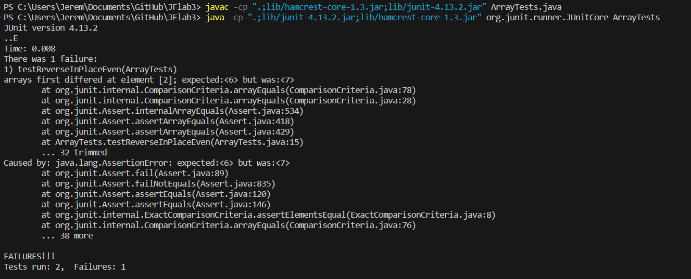

### Bugs and Commands 

---
Today, lets start by looking at bugs and testing. We'll be looking at a method called `reverseInPlace` that takes an `int[] arr` as argument and is meant to reverse the input array.  
Here is a failure inducing input for the program:
```
@Test
public void testReverseInPlace() {
    int[] input1 = { 5, 6, 7, 8 };
    ArrayExamples.reverseInPlace(input1);
    assertArrayEquals(new int[]{ 8, 7, 6, 5 },input1);
}
```
Despite this, there are still inputs that don't cause a failure such as:
```
@Test 
public void testReverseInPlace() {
    int[] input2 = { 3 };
    ArrayExamples.reverseInPlace(input2);
    assertArrayEquals(new int[]{ 3 }, input2);
}
```
Now lets look at the result of running these tests:

This failure is called a symptom. Now that we know the symptom and the input that leads to it, lets take a look at the code:  
  Before:
  ```
  static void reverseInPlace(int[] arr) {
    for(int i = 0; i < arr.length; i += 1) {
      arr[i] = arr[arr.length - i - 1];
    }
  }
  ```
  After:
  ```
  static void reverseInPlace(int[] arr) {
    for(int i = 0; i < arr.length/2; i ++) {
      int temp = arr[i];
      arr[i] = arr[arr.length - i - 1];
      arr[arr.length - i -1] = temp;
    }
  }
  ```
Initially, the code simply replaced the first half of the array with the values in the second half in reverse order, as it should. However, when it got to the second half of the array, it then replaced the second half with the first half. While this would have worked if the array hadn't been modified, it has been, so in the second half of the `for` loop, the second half is being replaced with the first half, which has already been overridden with the second half. This results in an array like `[1,2,3,4]` being reversed into `[4,3,3,4]` instead of `[4,3,2,1]` as it should have. The fix seen in the after works because the value from that first half of the array is stored in a temporary `int` variable before the element is overriden with the corrosponding element from the back half of the array. That `int` can then be put into the second half of the array in its correct spot, fixing the bug. Also note that the `for` loop only iterates through half the array becuase both halves of the array are being worked on in the new code above.

---
Now, lets switch gears and discuss some bash commands. Particularly we'll focus on the `find` command. There are a wide variety of ways to use the `find` command and a variety of ways to modify the command in the command line. We'll look at 4 ways to use this command: `-type`,` __`,` __`, `__`. All information on this command and its modifiers came from https://linuxhandbook.com/find-command-examples/ (linuxhandbook.com).

---
`-type`
```
[user@sahara ~/docsearch/technical]$ find . -type f | head
./911report/chapter-3.txt
./911report/chapter-11.txt
./911report/chapter-13.5.txt
./911report/chapter-9.txt
./911report/chapter-7.txt
./911report/chapter-8.txt
./911report/chapter-13.1.txt
./911report/chapter-5.txt
./911report/chapter-10.txt
./911report/chapter-13.2.txt
```
Note that the `| head` command simply shortens the output to a readable level and is beyond the scope of this discussion of the `find` command. Here, the command depicted searches the current directory and prints relative paths to all files. This is due to the `-type f` telling the program to look for files as opposed to directories. This may be useful if the programmer wants to count or work with all the files in their file structure without working with any directories.
```
[user@sahara ~/docsearch/technical]$ find . -type d 
.
./biomed
./911report
```
Here we see the `-type` command can be used with the `d` argument to get a list of relative paths to all directories in the given directory. This could be useful in any situation where the programmer wants a list of all directories. For example, they may want to add a certain file to each directory in a file structure, and could use this command to find each directory in that file structure so that those new files could be added.

---
`-iname` 
```
[user@sahara ~/docsearch/technical]$ find . -iname CHAPTER-1.TXT
./911report/chapter-1.txt
```
Here we see the command returning the relative path to the file name given as argument to the find command. Note that despite the argument being all upper case, it still returns the lowercase path. This would be very useful for programmers who don't know the naming conventions of the directory they are working in. This would stop any issues from arising due to unexpected capitalization when the user is trying to locate a file by name.
```
[user@sahara ~/docsearch/technical]$ find . -iname chapter-5.txt
./911report/chapter-5.txt
```
Here we see that despite the fact that the command is not case sensitive, it can still return the expected result when the argument is in lowercase. This would be useful as a default command if a programmer is simply trying to locate a file. While they could use the `-name` command, and should if they know that the file name is lowercase, using the `-iname` command allows them to find the file regardless of capitalization.

---
`-empty`
```
[user@sahara ~/docsearch/technical]$ find . -empty | head
./biomed/bcr303.txt
./biomed/1476-4598-2-2.txt
./biomed/1477-7827-1-23.txt
./biomed/ar79.txt
./biomed/1476-4598-1-5.txt
./biomed/bcr317.txt
./biomed/1477-7827-1-36.txt
./biomed/1477-7525-1-12.txt
./biomed/1476-9433-1-2.txt
./biomed/bcr294.txt
```
Here we see the command returns the relative paths of all empty files and directories whithin a directory. This could be useful for a data analyst who wants to confirm there are no empty files in a file structure so they can delete or otherwise handle them.
```
[user@sahara ~/docsearch/technical]$ find ./biomed/ -empty | head
./biomed/bcr303.txt
./biomed/1476-4598-2-2.txt
./biomed/1477-7827-1-23.txt
./biomed/ar79.txt
./biomed/1476-4598-1-5.txt
./biomed/bcr317.txt
./biomed/1477-7827-1-36.txt
./biomed/1477-7525-1-12.txt
./biomed/1476-9433-1-2.txt
./biomed/bcr294.txt
```
Here we see how the same command can be used to seach a specific directory other than the current working directory and return a list of the relative paths to empty files. This would be very useful if a programmer wanted to do any operation on all empty files, such as putting certain text in them or removing them.

---
`-o`
```
[user@sahara ~/docsearch/technical/911report]$ find . -name "*.txt" -o -name "*.js"
./chapter-13.3.txt
./chapter-13.2.txt
./chapter-6.txt
./chapter-5.txt
./chapter-8.txt
./preface.txt
./chapter-11.txt
./chapter-13.4.txt
./chapter-9.txt
./chapter-13.1.txt
./chapter-3.txt
./chapter-7.txt
./chapter-13.5.txt
./chapter-10.txt
./chapter-2.txt
./chapter-1.txt
./chapter-12.txt
./newJavaScriptFile.js
```
Here we see the `-o` command in effect, searching for files and directories within `911report` that meet the title parameters of either `.txt` or `.js`. This would allow programmers to use 'or' statements in their `find` command, allowing them to string multiple search parameters together. For instance, a programmer may want to find the file paths of all the python and java files in a directory to perform some operation on them.
```
[user@sahara ~/docsearch/technical/biomed]$ find . -name "*.txt" -o -name "*.java" | head
./1471-2172-3-12.txt
./1476-9433-1-2.txt
./1471-2156-3-10.txt
./1471-2148-1-1.txt
./ar409.txt
./1471-2202-2-8.txt
./1475-4924-1-10.txt
./1471-2156-2-8.txt
./1471-2458-2-18.txt
./1471-2458-2-11.txt
```
While the `|head` command is used here, there are no `.java` files in this directory, so the `-o` command only prints out `.txt` files. This demonstrates how this command can be used even if a programmer doesn't know which files are in their directory. It allows them to get all `.java` files if they exist, but still works even when none do.
