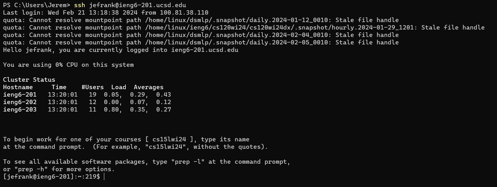
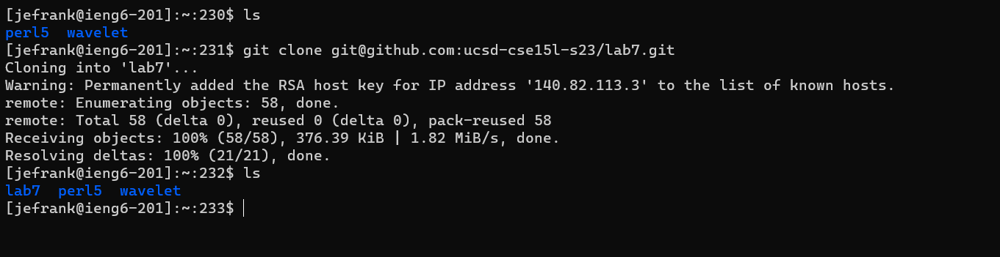
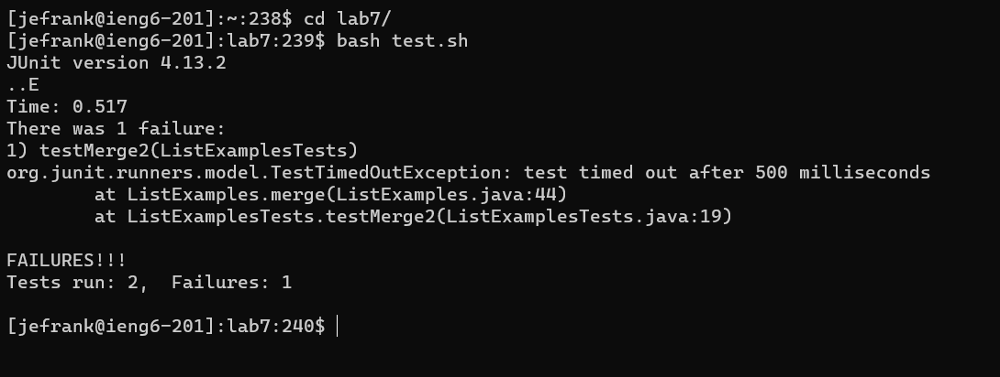
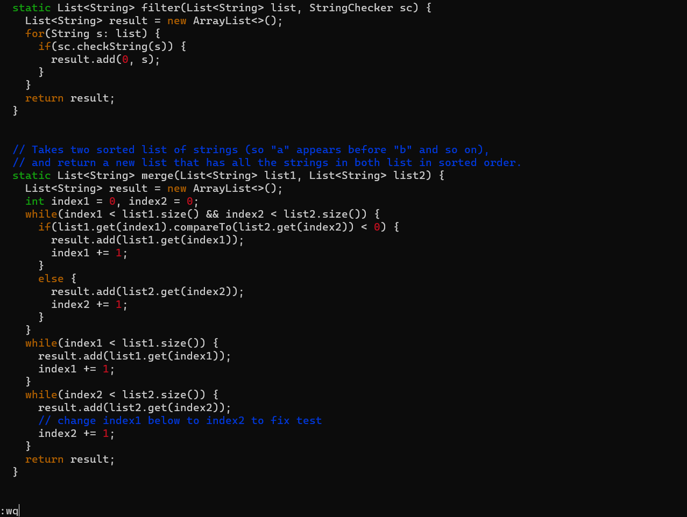

## Vim

---
In today's post, we'll be looking at how to edit files from the command line using `vim`. We'll walk though a series of coding exercises using only the terminal. First, we'll log into `ieng6`.  

Note that for this step, the coder simply hit the keys corresponding to the letters seen above yeilding the output shown in the terminal above and logging into `ieng6`.  
Next, we will clone the appropriate repository from our github account using a `ssh` url we've already linked to our github account. First, we have to copy `git@github.com:ucsd-cse15l-s23/lab7.git` from the gitub repository and then can type `git clone git@github.com:ucsd-cse15l-s23/lab7.git` in the terminal as seen in the image. This typing represents the only keystrokes used on this step.      

Next, we will run the `JUnit` tests on the `ListExamples.java` file that we just imported. First, we must type `cd lab7/` to get into the correct working directory. Then, we can type `bash test.sh` to run the `test.sh` file which runs the `JUnit` tests in `ListExamplesTests.java`. See the image below. These are the only keystrokes used on this step.  
 
Now that we've found the failed tests, we need to fix the bugs leading to those failures. However, it's not easy to do so without a text editor. Luckily, we can use the `vim` command to fix these bugs directly from the terminal. We start by typing `vim ListExamples.java` to open the vim editor with `ListExamples.java`. The only error in this file lies in the incrementing statement in the bottomost while loop which was originoally `index1 += 1` but should be `index2 += 1` We can use the following keystrokes to fix it: `<43j>` to move down 43 lines, `<e>` to move the cursor to point to the last character of the first word of the line (in this case the `1` in `index1`), `<s>`, which prepares to replace the next character with whatever the user enters an puts `vim` into `insert mode`, `<2>`, the correct value to place at the end of `index`, `<esc>` to return to normal mode, `<:wq>` to save and quit `vim`, and finally `<enter>` which puts the '<:wq>` command into effect and saves and exits the editor, saving the change we made. The image below shows a snapshot of this step.  

