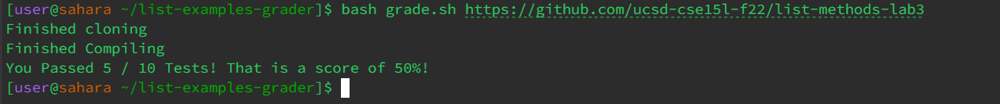

# Debugging and Reflecting
#### Debugging
Lets discuss debugging! Lets examine a hypothetical online interaction between a TA and a student as the student asks for help debugging their program. Lets look at an example student of a grading script, meant to grade student submitted code. The student's original code in their `grade.sh` file is below:
```
rm -rf student-submission
rm -rf grading-area

mkdir grading-area

git clone $1 student-submission 2> clone-output.txt
echo 'Finished cloning'

if [[ -f student-submission/ListExamples.java ]] 
then
    cp student-submission/ListExamples.java grading-area/
    cp TestListExamples.java grading-area/
else
    echo "Missing student-submission/ListExamples.java, did you forget the file or misname it? Score: 0"
    exit 1
fi

cd grading-area

CPATH='.;../lib/hamcrest-core-1.3.jar;../lib/junit-4.13.2.jar'
javac -cp $CPATH *.java 

if [[ $? -ne 0 ]] #if exit code != 0
then
    echo "The program failed to compile, see compile error above. Score: 0"
    exit 1
fi

echo "Finished Compiling"

java -cp $CPATH org.junit.runner.JUnitCore TestListExamples >junit-output.txt

testCheck=$(cat junit-output.txt | tail -n 2 | awk -F'[, ]' '{print $1}')

if [[ $testCheck = "OK" ]]
then
    tests=$(cat junit-output.txt | tail -n 2 | awk -F'[, ]' '{print $2}' | cut -b 2)
    echo "You Passed All Tests! That is a score of 100%!"
    exit 1
fi
tests=$(cat junit-output.txt | tail -n 2 | awk -F'[, ]' '{print $3}')
failures=$(cat junit-output.txt | tail -n 2 | head -n 1 | awk -F'[, ]' '{print $7}')
successes=$((tests-failures))

percent=$((100*successes/tests))
echo "You Passed $successes / $tests Tests! That is a score of $percent%!"
```
They had the following code in the TestListExamples.java file:
```
import static org.junit.Assert.*;
import org.junit.*;
import java.util.Arrays;
import java.util.List;

class IsMoon implements StringChecker {
  public boolean checkString(String s) {
    return s.equalsIgnoreCase("moon");
  }
}

public class TestListExamples {
  @Test(timeout = 500)
  public void testMergeRightEnd() {
    List<String> left = Arrays.asList("a", "b", "c");
    List<String> right = Arrays.asList("a", "d");
    List<String> merged = ListExamples.merge(left, right);
    List<String> expected = Arrays.asList("a", "a", "b", "c", "d");
    assertEquals(expected, merged);
  }
  @Test(timeout = 500)
  public void testMergeOneEmpty() {
    List<String> left = Arrays.asList();
    List<String> right = Arrays.asList("a", "d");
    List<String> merged = ListExamples.merge(left, right);
    List<String> expected = Arrays.asList("a","d");
    assertEquals(expected, merged);
  }
  @Test(timeout = 500)
  public void testMergeTwoEmpty() {
    List<String> left = Arrays.asList();
    List<String> right = Arrays.asList();
    List<String> merged = ListExamples.merge(left, right);
    List<String> expected = Arrays.asList();
    assertEquals(expected, merged);
  }
  @Test(timeout = 500)
  public void testMergeFinishOneEarly() {
    List<String> left = Arrays.asList("a","b","c");
    List<String> right = Arrays.asList("d","e","f");
    List<String> merged = ListExamples.merge(left, right);
    List<String> expected = Arrays.asList("a","b","c","d","e","f");
    assertEquals(expected, merged);
  }
  @Test(timeout = 500)
  public void testMergeDupes() {
    List<String> left = Arrays.asList("a","a","c");
    List<String> right = Arrays.asList("a","d","e");
    List<String> merged = ListExamples.merge(left, right);
    List<String> expected = Arrays.asList("a","a","a","c","d","e");
    assertEquals(expected, merged);
  }
  @Test(timeout = 500)
  public void testMergeAlt() {
    List<String> left = Arrays.asList("a","c","e");
    List<String> right = Arrays.asList("b","d","f");
    List<String> merged = ListExamples.merge(left, right);
    List<String> expected = Arrays.asList("a","b","c","d","e","f");
    assertEquals(expected, merged);
  }
  @Test(timeout = 500)
  public void testFilter0() {
	List<String> list = Arrays.asList("moon","noon","moon");
	List<String> filtered = ListExamples.filter(list,new IsMoon());
	List<String> expected = Arrays.asList("moon","moon");
	assertEquals(filtered,expected);}
  @Test(timeout = 500)
  public void testFilter1() {
    	  List<String> list = Arrays.asList("moon","noon","moon");
	  List<String> filtered = ListExamples.filter(list,new IsMoon());
	  List<String> expected = Arrays.asList("moon","moon");
	  assertEquals(filtered,expected);
}
  @Test(timeout = 500)
  public void testFilter2() {
    	  List<String> list = Arrays.asList("goon","noon","mood");
	  List<String> filtered = ListExamples.filter(list,new IsMoon());
	  List<String> expected = Arrays.asList();
	  assertEquals(filtered,expected);
}
@Test(timeout = 500)
  public void testFilte3() {
    	  List<String> list = Arrays.asList("moon","noon","moon");
	  List<String> filtered = ListExamples.filter(list,new IsMoon());
	  List<String> expected = Arrays.asList("moon","moon");
    	  List<String> list2 = Arrays.asList("moon","noon","moo");
	  List<String> filtered2 = ListExamples.filter(list2,new IsMoon());
	  List<String> expected2 = Arrays.asList("moon");
	  assertEquals(filtered,expected);
    assertEquals(filtered2,expected2);
}
}
```
While there are many other files in the student's file structure, these two are the only relavant ones in this situation, so for the sake of space and readability I will leave the contents of those other files out.
The student's file structure after running the code looks like this:
```
list-examples-grader/
|--grading-area/
|  |--ListExamples.java
|  |--TestListExamples.java
|--lib/
|  |--hamcrest-core-1.3.jar
|  |--junit-4.13.2.jar
|--student-submission/
|  |--ListExamples.java
|--GradeServer.java
|--Server.java
|--TestListExamples.java
|--clone-output.txt
|--grade.sh
```
Here is the student's post asking for help:
> HELPPPP! I've been trying to fix this for HOURS! No matter what input I give to the program, all my tests seem to fail. I don't know if my JUnit is installed incorrectly? Or if there's something wrong with my testing class? Here's an image of the error message: The command I used to get it was `bash grade.sh https://github.com/ucsd-cse15l-f22/list-methods-lab3`. I got the link from the week 6 lab writeup and I used the command from the `list-examples-grader/` working directory.
Here is the TA's response:
> Hi! I think you're looking in the wrong place. Your `TestListExamples.java` file looks alright. There may be somethign wrong with your `grade.sh` file. Think about where in that file you call your `TestListExamples.java` file!

Reading the TA's response, the student may examine the lines of code below:
```
CPATH='.;../lib/hamcrest-core-1.3.jar;../lib/junit-4.13.2.jar'
javac -cp $CPATH *.java 

if [[ $? -ne 0 ]] #if exit code != 0
then
    echo "The program failed to compile, see compile error above. Score: 0"
    exit 1
fi

echo "Finished Compiling"

java -cp $CPATH org.junit.runner.JUnitCore TestListExamples >junit-output.txt
```
This may allow them to see that the bug lies in their `CPATH` variable. The student used `.;../lib/hamcrest-core-1.3.jar;../lib/junit-4.13.2.jar` instead of `.:../lib/hamcrest-core-1.3.jar:../lib/junit-4.13.2.jar`. The student may have been used to writing code on operating systems that use the semicolon syntax, but in the environement the student is currently in, this notation threw an error. After making this change, the student sees the following output:

As you can see, fixing this bug fixed the student's program, by altering the valu of the `CPATH` variable as seen above.

---
#### Reflecting
I really enjoyed building the autograder in the last lab. It was really cool to be able to take a deeper dive into how the system could be improved for users. An interesting thing I learned was the `OSTYPE` varaible and how it can be used to determine the user's operating system when writing scripts that are dependant on that operating system. I also appreciated learning about `if` statements in `bash`. I feel like they really opened up the language for me as far as its applications and ways I could imagine using it.
